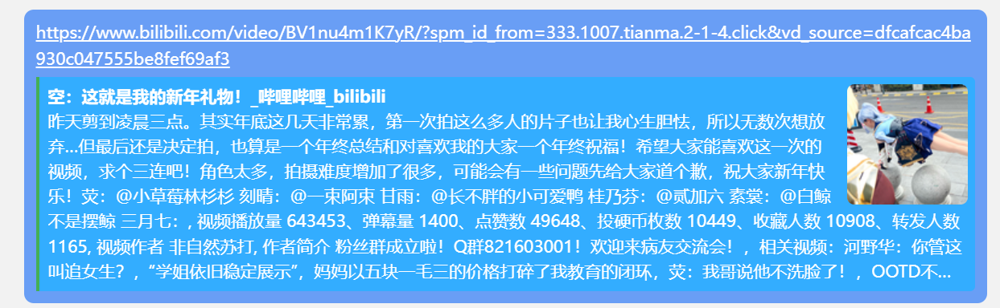
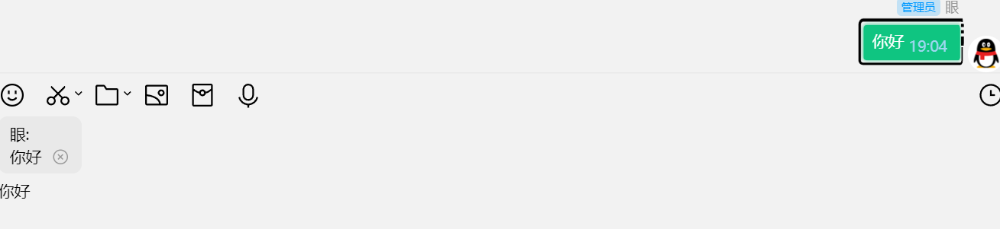
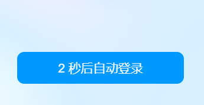
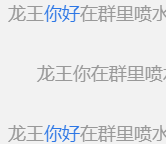

<!--
 * @Author: Night-stars-1 nujj1042633805@gmail.com
 * @Date: 2024-01-09 00:35:34
 * @LastEditors: Night-stars-1 nujj1042633805@gmail.com
 * @LastEditTime: 2024-02-21 19:11:41
-->
# LiteLoaderQQNT-Plugin-RepeatMsg | 复读姬 | QQ增强
该插件需要安装前置插件[LLAPI](https://github.com/Night-stars-1/LiteLoaderQQNT-Plugin-LLAPI)

本地表情支持图片和网络链接,base64未测试

链接表情写入`remotes.txt`即可

## 功能列表

|                    |                       |                        |                        |
| ------------------ | --------------------- | ---------------------- | ---------------------- |
| 消息复读           | [链接预览](#1)        | 屏蔽通话               | 点击图片外区域关闭图片 |
| 消息时间复读       | 消息翻译              | [群聊好友名称补全](#5) | 侧边栏管理             |
| 识别二维码         | [CHATGPT协助聊天](#3) | 自动忘记密码           | 聊天栏管理             |
| [消息显示时间](#2) | [禁止回复自动AT](#3)  | 隐藏未加载的插件       | 顶栏管理               |
| 时间自定义颜色     | 双击空白回复自动AT    | 本地表情               | [表情屏蔽管理](#6)     |
| 小程序转卡片       | 自动语音转文字        | 消息合并               | 自定义表情屏蔽提示     |
| 屏蔽更新           | [自动登录](#4)        | 输入历史               |                        |

## 部分功能展示
### 链接预览

### 消息时间

### CHATGPT协助聊天/禁止回复自动AT

### 自动登录

### 群聊好友名称补全

### 表情屏蔽管理
